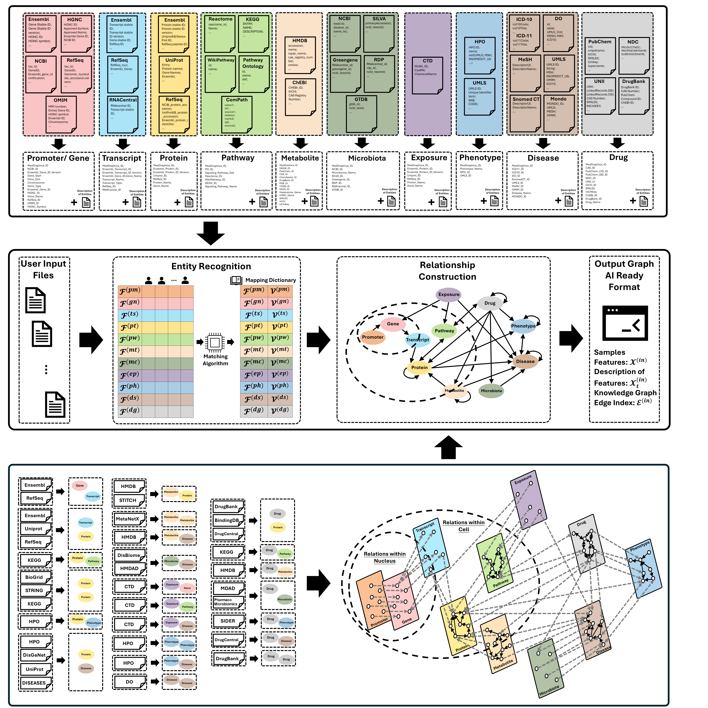

# BioMedGraphica

## An All-in-One Platform for Biomedical Prior Knowledge and Omic Signaling Graph Generation

 
  

---

Artificial intelligence (AI) is transforming scientific discovery by leveraging its scalable capabilities to integrate and analyze large-scale datasets for knowledge mining. Foundation models—such as large language models (LLMs) and large vision models (LVMs)—are enabling general-purpose AI, yet they rely on highly structured data that is rarely available in the biomedical domain.

In contrast, biomedical data remains **fragmented**, with knowledge scattered across publications and inconsistent databases, each using diverse nomenclature systems. These discrepancies, spanning from genes to clinical traits, present significant challenges for **AI in Precision Health and Medicine (AI4PHM)**.

To address this, we introduce **BioMedGraphica**, an **all-in-one platform** for:
- Biomedical data integration across 43 databases
- Unified **Text-Attributed Knowledge Graph (TAKG)** generation
- Multi-omics and prior knowledge-driven graph AI applications

---



---

## 📦 What is BioMedGraphica?

- **3,131,788 Entities**  
- **56,817,063 Relations**  
- **11 Entity Types** and **29 Harmonized Relation Types**  
- Fully attributed with unique IDs and **textual descriptions**
- Enables **zero-shot / few-shot knowledge discovery** via relation prediction
- Generates **graph AI-ready subgraphs** tailored to custom datasets

---

## 🧠 Use Cases

- Graph-based AI model training (e.g., GNNs, LLMs with graphs)
- Discovery of novel disease mechanisms and pathways
- Target and drug prioritization in AI4PHM
- Multi-omics signaling graph construction
- Synergistic drug cocktail inference

---

## 🖥️ GUI & Software

BioMedGraphica offers an intuitive **Windows-based GUI**, allowing users to:
- Input multi-omics and clinical files
- Perform entity recognition (hard/soft matching)
- Construct user-specific knowledge-omic signaling graphs
- Export graph-ready `.npy` files for downstream AI modeling

---

## 🔗 Quick Access

- [🌐 Webpage (Coming Soon)](https://www.google.com)
- [📄 Paper (bioRxiv)](https://www.google.com)
- [📂 Hugging Face Dataset](https://huggingface.co/datasets/FuhaiLiAiLab/BioMedGraphica/tree/main)
- [🎬 Demo Video](./Videos/demo.mp4)

---

## 🗃️ Dataset Downloads

We recommend using the **[BioMedGraphica-Conn](https://huggingface.co/datasets/FuhaiLiAiLab/BioMedGraphica/tree/main/BioMedGraphica-Conn)** dataset, which excludes isolated nodes to support efficient graph training.

---

## 📁 Repository Structure

### 1. Data Collection

Check the structured data resource documentation [here](./DataCollection.md)

### 2. Data Processing

Scripts and processing logic are in the `BioMedGraphica-Raw` folder

### 3. GUI Software

The software will be released soon — a demo is available [here](./Videos/demo.mp4)

---

## 📚 Citation

If you use BioMedGraphica, please cite:

```bibtex
@article{zhang2024biomedgraphica,
  title={BioMedGraphica: An All-in-One Platform for Biomedical Prior Knowledge and Omic Signaling Graph Generation},
  author={Zhang, Heming and Liang, Shunning and Xu, Tim and Li, Wenyu and Huang, Di and Dong, Yuhan and Li, Guangfu and Miller, J Philip and Goedegebuure, S Peter and Sardiello, Marco and others},
  journal={bioRxiv},
  year={2024}
}
